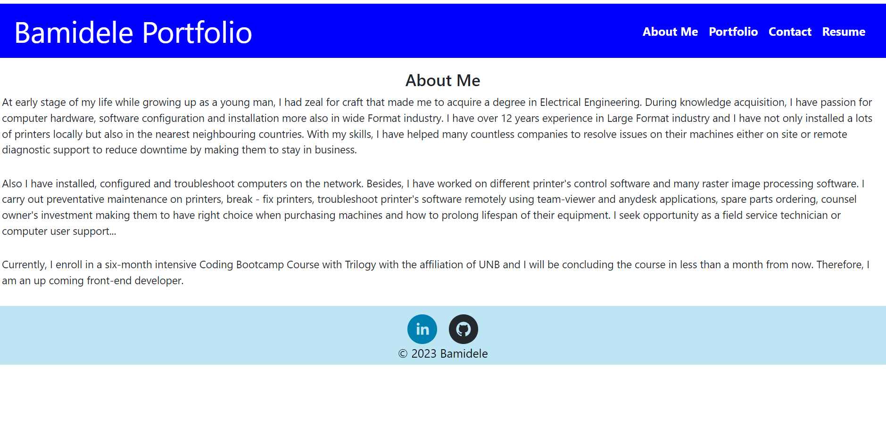
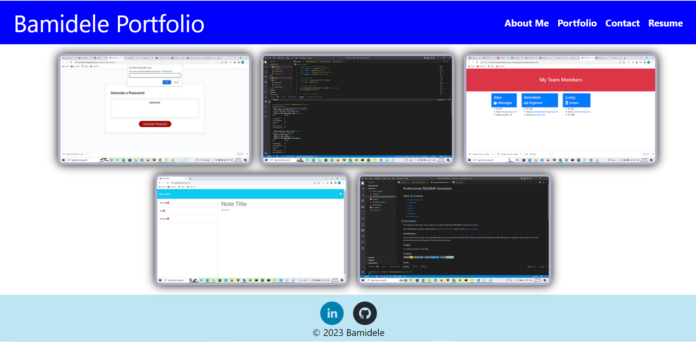
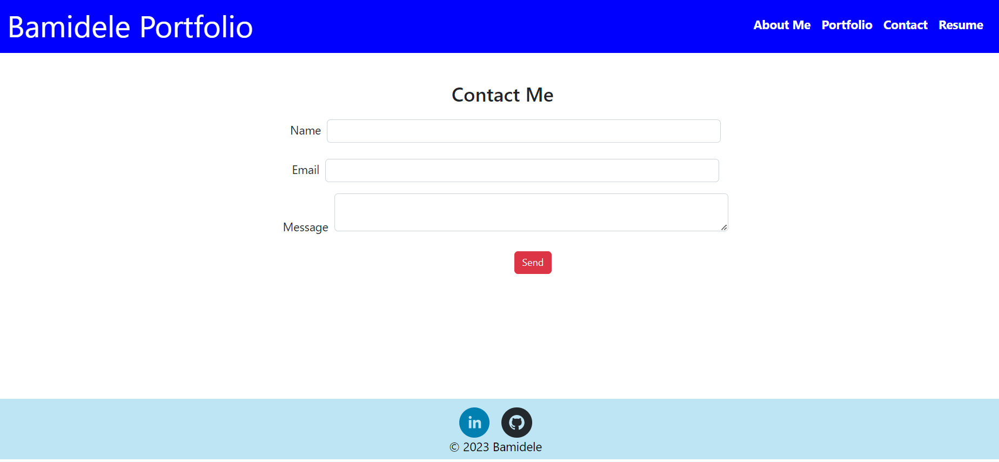
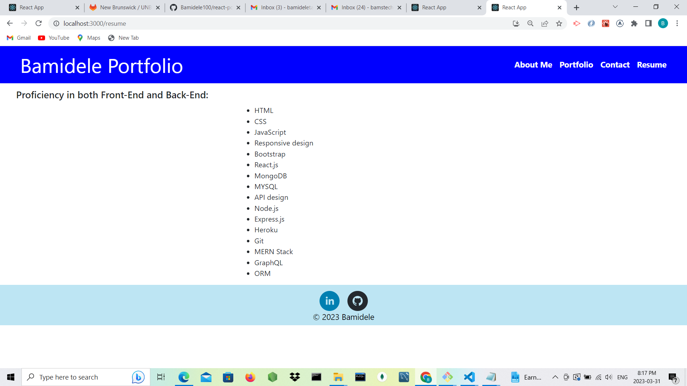

# React Portfolio

## Description

The goal of this assignment is to create react portfolio so as to showcase skills learned so far on react topic. The application consists of header, body and footer. The header contain the About me, Portfolio, Contact and Resume pages. When each of the pages are clicked, the pages will navigate to the clicked or right page and display.

## Built With:

Javascript,
NodeJS,
React,
Bootstrap,
React Router documentation,
React Social Icons

## Generated images

### `npm start`

Runs the app in the development mode.
Open [http://localhost:3000](http://localhost:3000) to view it in your browser.

## Deployed URL and Repository

https://bamidele100.github.io/react-portfolio/

https://github.com/Bamidele100/react-portfolio.git
